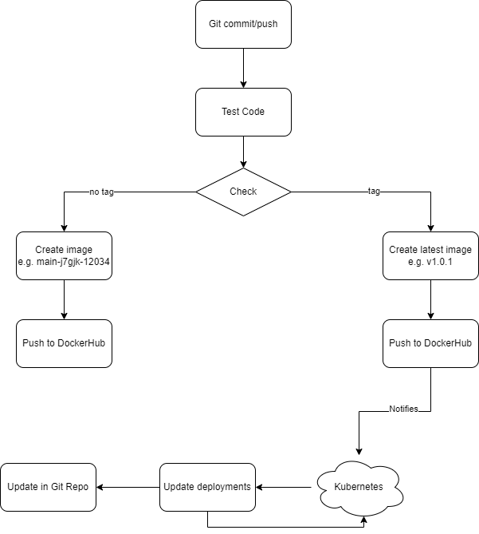

# Flux-CI-CD
Cloud Computing project using GitHub, Kubernetes and Flux for a CI/CD pipeline.

## Proposal

We plan to set up a CI/CD pipeline using GitHub, DockerHub, Kubernetes and Flux. This would include automatic testing and image generation, live deployment updates using these images, deployment manifest updates with new version numbers and deployment manifest synchronization between GitHub and the running cluster.




As shown, the image name would depend on whether a tag was used or not. The kubernetes cluster would only update to versions with the same major version and ignore all non semver named images, i.e. main-j7gjk-12034 would be ingored.

As a basis we would use the deployment demo presented in the lecture. We would update the CI pipeline to produce the naming discussed above. We would then add Flux for manifest synchronization and [Flux image updates](https://fluxcd.io/flux/guides/image-update/) for automatic version updating.

We believe this project should be categorized as advanced, because it extends the project "GitOps" described in the "Project Ideas" pdf by also incorporating automatic image updates.

### Intended Development Usage

This would be intended for usage with [Trunk-based development](https://cloud.google.com/architecture/devops/devops-tech-trunk-based-development) shown in the image below.


### Demo

For demo purposes, we could create a new repository and show all steps involved or use an existing repository to demonstrate the (push tag -> generate image -> update manifests -> update deployments) pipeline, or both.

### Work split

| Member      | Tasks |
| ----------- | ----------- |
| Christoph Pfleger | Create Proposal (find resources, check feasibility, design illustrations), Adapting CI pipeline, add basic Flux reconciliation |
| Luis Nachtigall | Discussion on how to implement Proposal with Development workflow, Add image updates (to Kubernetes cluster and GitHub manifests) |

### Extra Ideas

If this is seen as too small or to unrealistic, there is an additional idea we could implement:
- Adding a staging cluster that automatically loads images from normal pushes for testing

## Setup

### 1. Resource Setup

- Increase number of nodes to 2, otherwise it won't run. Using gcloud: gcloud console -> Kubernetes Engine -> my-cluster -> Nodes -> default-pool -> Edit -> set "Number of nodes" to 2 -> Save

- Create a github repository and set it as public. Add the "app" folder and the "CI.yml" and "cluster/deployment.yaml" files to the new repository. Change image path in the deployment file to your own docker hub username.

- Create a personal access token with at least "Read and Write access to administration and code" for the repository.

- Create a docker hub access token and add it and your username as repository secrets named DOCKER_HUB_ACCESS_TOKEN and DOCKER_HUB_USERNAME respectively. Repository -> Settings -> Secrets and variables -> Actions -> Repository secrets

In the following, there are points where you have to wait for periodic checks between the cluster and the repository. If you do not want to wait, use the following command at those points:

```
flux reconcile kustomization flux-system --with-source
```

Run all of these commands in your local repository folder. Many of these commands just create config files, which then need to be pushed upstream to get synchronized to the cluster.

### 2. Add Github Action

The github workflow we use is based on the one used in the lecture. We adapted it to use github tags as image names when available and also added a condition to prevent runs on automatic fluxcd commits. You can also disable the CI run for a push by including "no-CI" in the last commit message. To use it move "CI.yml" to ".github/workflows/".

After adding the workflow locally and pushing it upstream, create a new release for the repository with the tag "v1.0.0". This will create a new image with that version, which will be used as the base image used in the cluster.

### 3. Create Flux Files

Add your github username and the generated access token to your console environment variables.

```
set GITHUB_TOKEN=
set GITHUB_USER=
```

Create a link between the cluster and the repository. After this point, any changes to config files in the "cluster" folder will automatically be reflected on the cluster. Change repository name in the command if necessary.

```
flux bootstrap github ^
    --components-extra=image-reflector-controller,image-automation-controller ^
    --owner=%GITHUB_USER% ^
    --repository=Flux-CI-CD ^
    --branch=main ^
    --path=cluster ^
    --interval=1m0s ^
    --read-write-key ^
    --personal
```

Push local changes upstream.

Check for errors using the following command. This will inform you if your cluster has too few nodes.

```
kubectl get events -n flux-system --field-selector type=Warning
```

If everything worked, the deployment should now be running in the cluster. Check with:

```
kubectl get deployment
```

### 4. Add automatic image updates

Create an image repository object, which periodically checks for new images. Keep in mind that this image path should be the same as the one used in "cluster/deployment.yaml".

```
flux create image repository app ^
    --image=chripp/app ^
    --interval=1m0s ^
    --export > ./cluster/app-registry.yaml
```

Create an image policy, which specifies how images are updated. In this case "^v1.0.0" means that it updates minor and bug versions, but not major versions.

```
flux create image policy app ^
    --image-ref=app ^
    --select-semver="^v1.0.0" ^
    --export > ./cluster/app-policy.yaml
```

Push local changes upstream.

Wait for reconcilliation, then check that everything works with the command below.

```
flux get image policy app
```

In cluster/deployment.yaml after "image: chripp/app:v1.0.0" add:
```
# {"$imagepolicy": "flux-system:app"}
```

If pushed, automatic image updates would already work. However, while the live environment would get updated, the github repository would not reflect that. Therefore, there is one last step.

Add an automation object which periodically updates the config files in the github repo.

```
flux create image update flux-system ^
    --git-repo-ref=flux-system ^
    --git-repo-path="./cluster" ^
    --checkout-branch=main ^
    --push-branch=main ^
    --author-name=fluxcdbot ^
    --author-email=fluxcdbot@users.noreply.github.com ^
    --commit-template="{{range .Updated.Images}}{{println .}}{{end}}" ^
    --interval=1m0s ^
    --export > ./cluster/demo-automation.yaml
```

Push local changes upstream.

Again wait for reconcilliation, then check for errors.

```
flux get images all --all-namespaces
```

### 5. Watch in action

Generate a new version by making a new release with a higher version tag.

Flux should find this new version and update the pods. Check with:

```
kubectl get deployment -o yaml
```

Shortly after this, Flux should push the changed config to the github repository.

## Remove

```
flux uninstall
kubectl delete deployment demo
```
