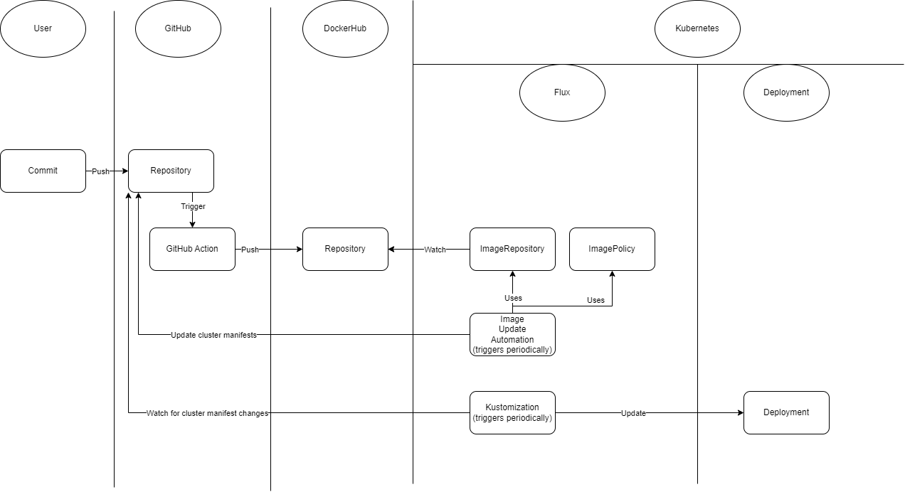

# Flux-CI-CD
Cloud Computing project using GitHub, Kubernetes and Flux for GitOps with CI/CD elements.

## Overview / Summary of research

This project illustrates how to use Flux for GitOps, extended with elements of CI/CD. This means assigning a GitHub repository as the main authority on what should be running in a cluster and then updating said cluster to match what is described in the repository. Further, we use CI/CD elements to present how image versions can automatically be updated in the versioned manifests, leading to updates in the cluster.

To accoplish this, Flux runs several pods on the cluster, which periodically check for discrepancies between outside resources (GitHub, DockerHub) and objects in the cluster.



Such a setup provides convenient versioning of configurations and can be used as one part of a full CD pipeline. Due to versioning, in case of issues with a new release the repository can just be reverted to an older stable version.

Updating image versions in the repository has the advantage that it is included in configuration file versioning and can therefore be reverted to if needed. The drawback is that if a revert is needed, the image update service in the cluster needs to be disabled (or the marker for updates in the config file removed) to stay on the stated version.

## Tutorial

### 1. Resource Setup

- Increase number of nodes to 2, otherwise it won't run. Using gcloud: gcloud console -> Kubernetes Engine -> my-cluster -> Nodes -> default-pool -> Edit -> set "Number of nodes" to 2 -> Save

- Create a github repository and set it as public. Add the "app" folder and the "CI.yml" and "cluster/deployment.yaml" files to the new repository. Change image path in the deployment file to your own docker hub username.

- Create a personal access token with at least "Read and Write access to administration and code" for the repository.

- Create a docker hub access token and add it and your username as repository secrets named DOCKER_HUB_ACCESS_TOKEN and DOCKER_HUB_USERNAME respectively. Repository -> Settings -> Secrets and variables -> Actions -> Repository secrets

In the following, there are points where you have to wait for periodic checks between the cluster and the repository. If you do not want to wait, use the following command at those points:

```
flux reconcile kustomization flux-system --with-source
```

Run all of these commands in your local repository folder. Many of these commands just create config files, which then need to be pushed upstream to get synchronized to the cluster.

### 2. Add Github Action

The github workflow we use is based on the one used in the lecture. We adapted it to use github tags as image names when available. To use it move "CI.yml" to ".github/workflows/".

After adding the workflow locally and pushing it upstream, create a new release for the repository with the tag "v1.0.0". This will create a new image with that version, which will be used as the base image used in the cluster.

### 3. Create Flux Files

Add your github username and the generated access token to your console environment variables.

```
set GITHUB_TOKEN=
set GITHUB_USER=
```

Create a link between the cluster and the repository. After this point, any changes to config files in the "cluster" folder will automatically be reflected on the cluster. Change repository name in the command if necessary.

```
flux bootstrap github ^
    --components-extra=image-reflector-controller,image-automation-controller ^
    --owner=%GITHUB_USER% ^
    --repository=Flux-CI-CD ^
    --branch=main ^
    --path=cluster ^
    --interval=30s ^
    --read-write-key ^
    --personal
```

Check for errors using the following command. This will inform you if your cluster has too few nodes.

```
kubectl get events -n flux-system --field-selector type=Warning
```

If everything worked, the deployment should now be running in the cluster. Check with:

```
kubectl get deployment
```

### 4. Add automatic image updates

Create an image repository object, which periodically checks for new images. Keep in mind that this image path should be the same as the one used in "cluster/deployment.yaml".

```
flux create image repository app ^
    --image=chripp/app ^
    --interval=30s ^
    --export > ./cluster/app-registry.yaml
```

Create an image policy, which specifies how images are updated. In this case "^v1.0.0" means that it updates minor and bug versions, but not major versions.

```
flux create image policy app ^
    --image-ref=app ^
    --select-semver="^v1.0.0" ^
    --export > ./cluster/app-policy.yaml
```

Push local changes upstream.

Wait for reconcilliation, then check that everything works with the command below.

```
flux get image policy app
```

In cluster/deployment.yaml after "image: chripp/app:v1.0.0" add:
```
# {"$imagepolicy": "flux-system:app"}
```

If pushed, automatic image updates would already work. However, while the live environment would get updated, the github repository would not reflect that. Therefore, there is one last step.

Add an automation object which periodically updates the config files in the github repo.

```
flux create image update flux-system ^
    --git-repo-ref=flux-system ^
    --git-repo-path="./cluster" ^
    --checkout-branch=main ^
    --push-branch=main ^
    --author-name=fluxcdbot ^
    --author-email=fluxcdbot@users.noreply.github.com ^
    --commit-template="{{range .Updated.Images}}{{println .}}{{end}}" ^
    --interval=30s ^
    --export > ./cluster/demo-automation.yaml
```

Push local changes upstream.

Again wait for reconcilliation, then check for errors.

```
flux get images all --all-namespaces
```

### 5. Watch in action

### GitOps

Change the number of replicas in "deployment.yaml". Shortly after, the changes are reflected in the cluster. Check with:

```
kubectl describe deployment demo
```

### Image update

Generate a new image version by making a new release with a higher version tag.

Flux should find this new version and update the pods. Again, check with:

```
kubectl describe deployment demo
```

Shortly after this, Flux should push the changed config to the github repository.

### 6. Remove

```
flux uninstall
kubectl delete deployment demo
```

## Lessons-Learned

Due to our modifications to the CI workflow, we became more familiar with writing them. For example, we learned how to disable a workflow based on who made the last commit of a push, which can be used to disable CI runs on commits by Flux, which do not change the code.

From Flux, we learned that pods running in our cluster can be used for maintenance and observation of outside resources. While this has been mentioned before, it was made much more obvious by Flux using pods to e.g. monitor image repositories for new versions.

We also learned that while Continuous Deployment solutions like Flux can be very customizable, it really helps to consider such things before starting a project. This helps to keep the setup as simple as possible and can help to avoid configuration errors later.
